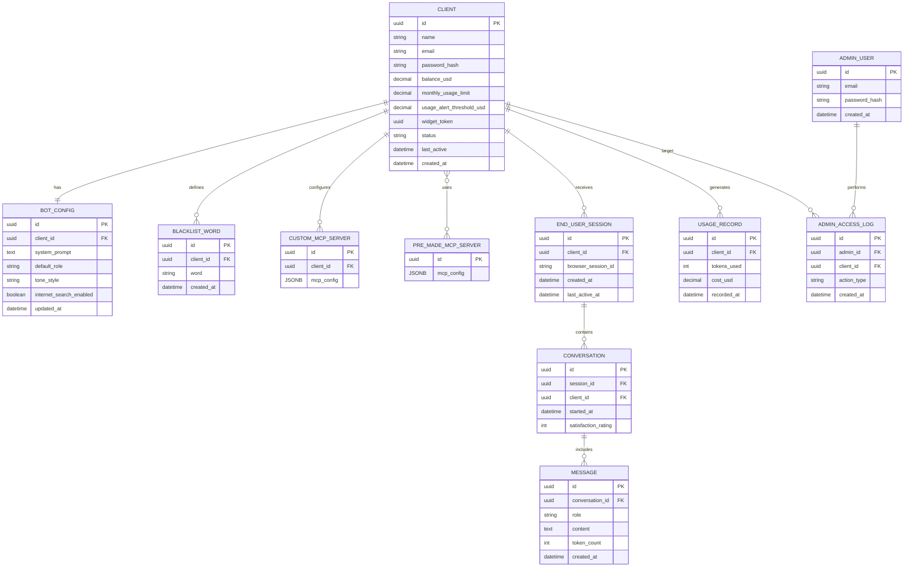

```mermaid
erDiagram
    CLIENT {
        uuid id PK
        string name
        string email
        string password_hash
        decimal balance_usd
        decimal monthly_usage_limit
        decimal usage_alert_threshold_usd
        uuid widget_token
        string status
        datetime last_active
        datetime created_at
    }

    BOT_CONFIG {
        uuid id PK
        uuid client_id FK
        text system_prompt
        string default_role
        string tone_style
        boolean internet_search_enabled
        datetime updated_at
    }

    BLACKLIST_WORD {
        uuid id PK
        uuid client_id FK
        string word
        datetime created_at
    }

    CUSTOM_MCP_SERVER {
        uuid id PK
        uuid client_id FK
        JSONB mcp_config
    }

    PRE_MADE_MCP_SERVER {
        uuid id PK
        JSONB mcp_config
    }

    END_USER_SESSION {
        uuid id PK
        uuid client_id FK
        string browser_session_id
        datetime created_at
        datetime last_active_at
    }

    CONVERSATION {
        uuid id PK
        uuid session_id FK
        uuid client_id FK
        datetime started_at
        int satisfaction_rating
    }

    MESSAGE {
        uuid id PK
        uuid conversation_id FK
        string role
        text content
        int token_count
        datetime created_at
    }

    USAGE_RECORD {
        uuid id PK
        uuid client_id FK
        int tokens_used
        decimal cost_usd
        datetime recorded_at
    }

    ADMIN_USER {
        uuid id PK
        string email
        string password_hash
        datetime created_at
    }

    ADMIN_ACCESS_LOG {
        uuid id PK
        uuid admin_id FK
        uuid client_id FK
        string action_type
        datetime created_at
    }

    %% TODO: WIDGET_CONFIG entity is not yet defined — columns TBD
    CLIENT ||--|| BOT_CONFIG : has
    CLIENT ||--o{ BLACKLIST_WORD : defines
    CLIENT ||--o{ CUSTOM_MCP_SERVER : configures
    CLIENT }o--o{ PRE_MADE_MCP_SERVER : uses
    CLIENT ||--o{ END_USER_SESSION : receives
    CLIENT ||--o{ USAGE_RECORD : generates

    END_USER_SESSION ||--o{ CONVERSATION : contains
    CONVERSATION ||--o{ MESSAGE : includes

    ADMIN_USER ||--o{ ADMIN_ACCESS_LOG : performs
    CLIENT ||--o{ ADMIN_ACCESS_LOG : target

```