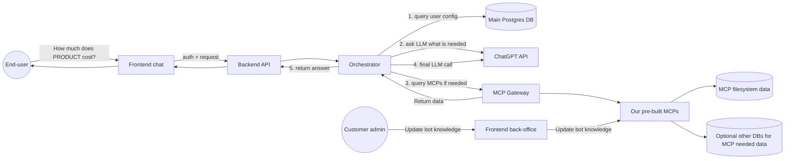

```mermaid

flowchart LR

%% Actors
User((End-user))
Admin((Customer admin))

%% Frontend / Backend
FE[Frontend chat]
BE[Backend API]
ORCH[Orchestrator]

%% Core services
DB[(Main Postgres DB)]
LLM[ChatGPT API]
MCPGW[MCP Gateway]

%% MCPs
MCP1[Our pre-built MCPs]

%% MCP Data sources
MCPDB[(MCP filesystem data)]
CustomerDB[(Optional other DBs for MCP needed data)]

%% Back-office
BackOffice[Frontend back-office]

%% User flow
User -->|"How much does PRODUCT cost?"| FE
FE -->|auth + request| BE
BE --> ORCH

%% Orchestration steps
ORCH -->|1. query user config| DB
ORCH -->|2. ask LLM what is needed| LLM
ORCH -->|3. query MCPs if needed| MCPGW

MCPGW --> MCP1

MCP1 --> MCPDB
MCP1 --> CustomerDB

MCPGW -->|Return data| ORCH
ORCH -->|4. final LLM call| LLM

%% Response
ORCH -->|5. return answer| BE
BE --> FE
FE --> User

%% Admin flow
Admin -->|Update bot knowledge| BackOffice
BackOffice -->|Update bot knowledge| MCP1
```